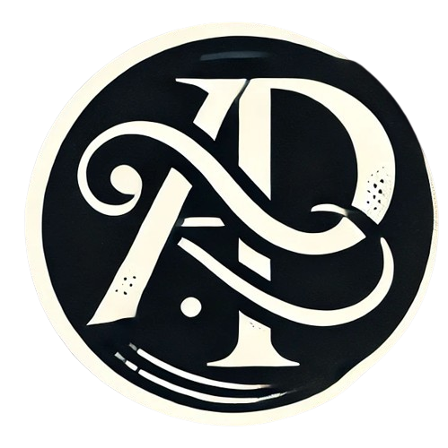
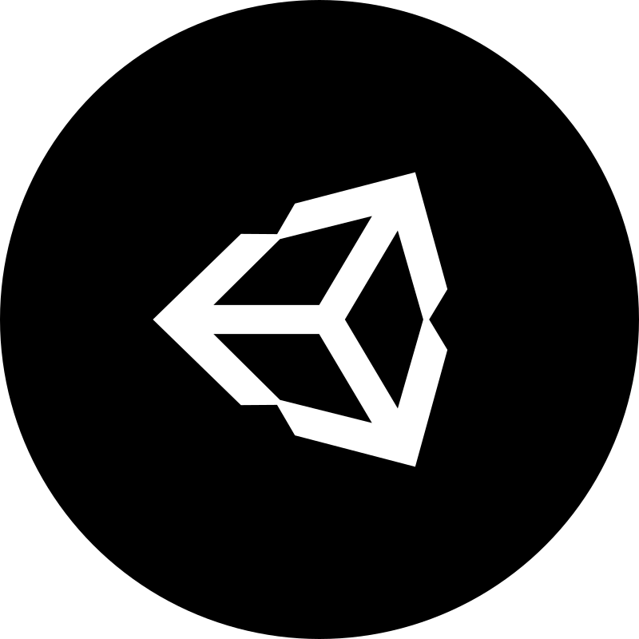

<h1 align="center">
  
</h1>

<h5 align="center">
  <code><a href="https://www.linkedin.com/in/aditya-pandhare-7b86a8261/" title="LinkedIn Profile"> LinkedIn</a></code>
  <code><a href="https://www.adityapandhare.com/" title="Portfolio Website"> Website</a></code>
  <code><a href="mailto:adityapandhare44@gmail.com" title="Email"> Email</a></code>
  <code><a href="https://github.com/awesomeadi00" title="GitHub"> GitHub</a></code>
</h5>
 

  🎓 B.Sc. Computer Science, NYU Abu Dhabi – <strong>Summa Cum Laude</strong>  
  💡 <strong>Interests</strong>: 
    <ul>
      <li>Machine Learning</li>
      <li>Deep Learning</li>
      <li>Data Science</li>
      <li>Software Engineering</li>
      <li>Game Development</li>
    </ul>
     
  🔧 <strong>I build:</strong>
  <ul>
    <li>🧠 LLM-powered applications (LangChain, OpenAI, etc.)</li>
    <li>🛠️ Full-stack systems using modern web frameworks</li>
    <li>🧪 Experimental MLOps and deep learning pipelines</li>
  </ul>
  💬 Let’s talk about <strong>creative tech, applied AI, or your next cool idea.</strong>

<h2 align="center">🔥 Languages & Frameworks & Tools 🔥</h2>
 

  <code></code>
  <code></code>
  <code></code>
  <code></code>
  <code></code>
  <code></code>
  <code></code>
  <code></code>
  <code></code>
  <code></code>
  <code></code>
  <code></code>
  <code></code>
  <code></code>
  <code></code>
  <code></code>
  <code></code>
  <code></code>
  <code></code>
  <code></code>
  <code></code>
  <code></code>
  <code></code>
  <code></code>
  <code></code>
  <code></code>
  <code></code>

