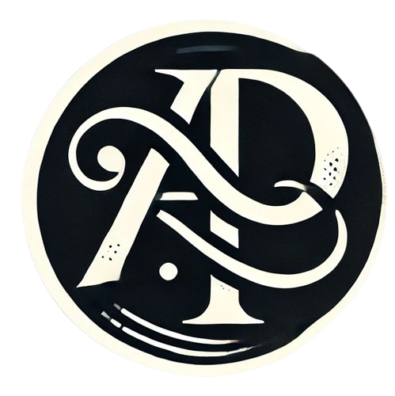

<h1 align="center">
  
</h1>

<h3 align="center">
  <code><a href="https://www.linkedin.com/in/aditya-pandhare-7b86a8261/" title="LinkedIn Profile"> LinkedIn</a></code>
  <code><a href="https://www.adityapandhare.com/" title="Portfolio Website"> Website</a></code>
  <code><a href="mailto:adityapandhare44@gmail.com" title="Email"> Email</a></code>
  <code><a href="https://github.com/awesomeadi00" title="GitHub"> GitHub</a></code>
</h3>

---

### 🎓 B.Sc. Computer Science, NYU Abu Dhabi

### 💡 My Interests:
- 🧠 Machine/Deep Learning    
- 📊 Data Science  
- 🧑‍💻 Software Engineering  
- 🎮 Game Development  

### 🔧 I build:
- 🤖 LLM-powered applications (LangChain, OpenAI, etc.)  
- 🌐 Full-stack systems using modern web frameworks  
- 🔬 Experimental MLOps and deep learning pipelines  

💬 Let’s talk about **creative tech, applied AI, or some cool ideas!**
